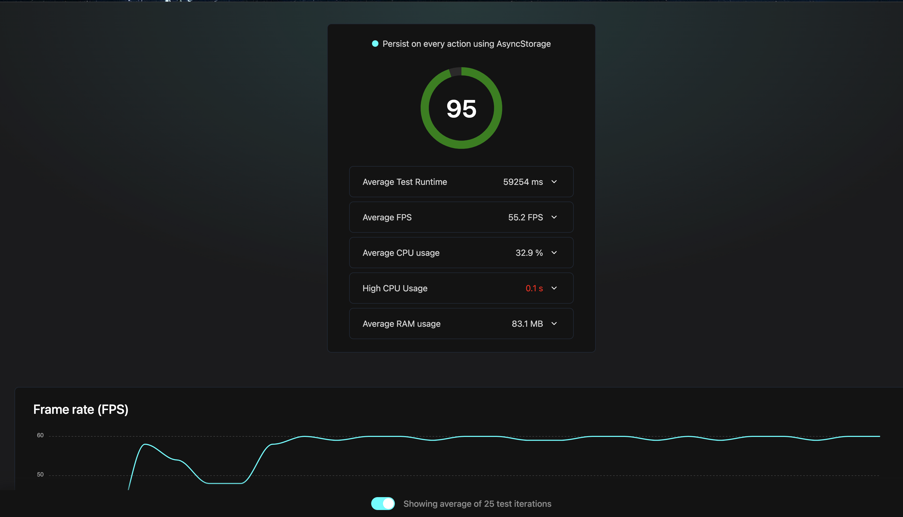

# Experiment: Evaluating Redux Persist with Different Storage Engines in React Native

## Objective

This experiment examines the impact of different storage engines and persistence strategies on performance in React Native applications. The goal is to highlight the inefficiencies of the default `redux-persist` approach and suggest improvements for optimizing offline-first development practices.

## Background

Offline-first development in React Native typically involves using `redux-persist` with a storage engine such as `AsyncStorage` to persist application state. However, this approach may lead to performance bottlenecks due to the frequency of writes, especially for large stores.

This experiment compares three configurations:

1. `redux-persist` with `AsyncStorage`
2. `redux-persist` with `react-native-mmkv`
3. A custom hook-based persistence mechanism without `redux-persist`

## Experiment Setup

### Branches and Configurations

#### 1. **Branch: `asyncstorage-redux-persist`**
- **Description**: Uses `redux-persist` with `AsyncStorage` as the storage engine.
- **Performance Report**: Includes a Flashlight report detailing:
  - The impact on FPS.
  - The impact of storage operations on CPU usage.

---

#### 2. **Branch: `mmkv-redux-persist`**
- **Description**: Uses `redux-persist` with `react-native-mmkv` as the storage engine.

---

#### 3. **Branch: `no-redux-persist`**
- **Description**: A custom persistence mechanism that does not use `redux-persist`. Instead, state persistence is triggered when the app transitions to an inactive state, leveraging a custom hook.
- **Performance Report**: Details:
  - Minimal performance overhead during active application use.
  - A significant reduction in the frequency of write operations.
  - Linear scaling of operations based on app transitions, as opposed to constant state writes.

---

## Key Findings

1. **Performance Bottlenecks of `redux-persist` with `AsyncStorage`**:
   - Frequent write operations degrade application responsiveness.
   - Linear growth in storage operations as the Redux store scales.
   - Significant delays in state retrieval after app restarts.

2. **Advantages of `react-native-mmkv`**:
   - Drastically improved performance compared to `AsyncStorage`.
   - Near-instant read and write operations.
   - Better scalability for large Redux stores.

3. **Efficiency of Custom Hook-Based Persistence**:
   - Persistence triggered only during app state transitions minimizes active write operations.
   - Maintains a linear growth of operations but avoids constant writes during runtime.
   - Ideal for scenarios requiring efficient state management and minimal runtime overhead.

---

## Conclusion

### Observations:
- The default `redux-persist` approach is inefficient for offline-first React Native applications due to constant state writes.
- Introducing `react-native-mmkv` improves performance but does not address the fundamental issue of frequent write operations.
- A custom persistence strategy, such as batching writes during app state transitions, offers significant efficiency gains.

### Recommendations:
- **Short-term**: Switch to `react-native-mmkv` for better performance without major code changes.
- **Long-term**: Replace constant writes with a throttled or app-state-triggered persistence mechanism to reduce overhead.

By revisiting persistence strategies, React Native developers can achieve smoother performance while maintaining offline-first functionality.
